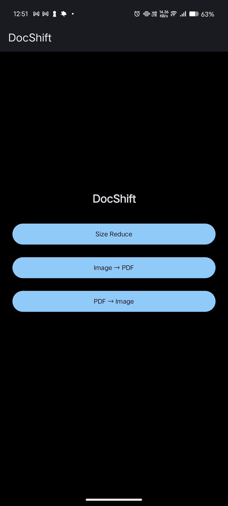
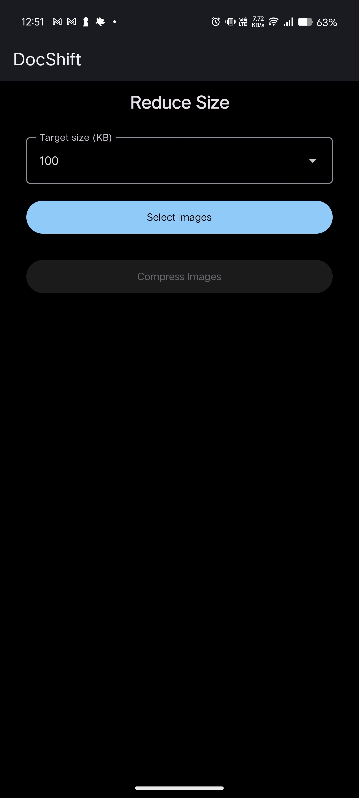
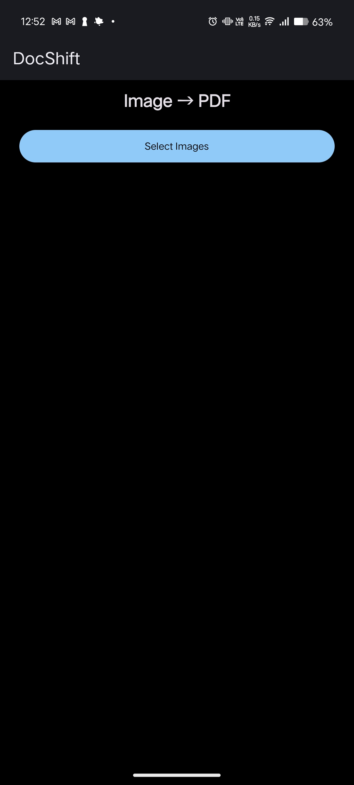
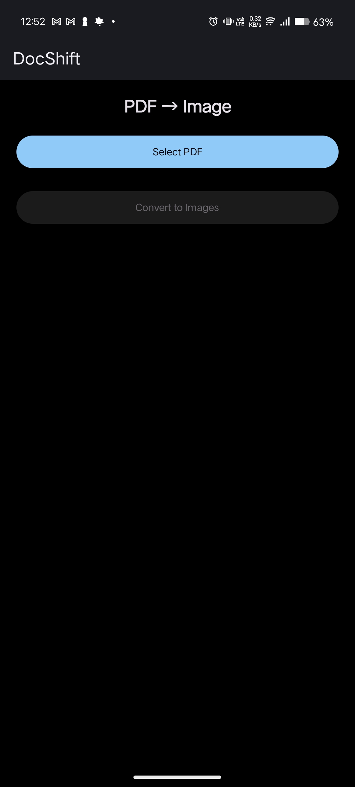
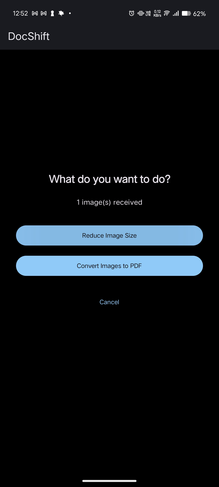

# DocShift

DocShift is a lightweight Android utility app for working with images and PDFs.  
It allows you to compress images, convert images to PDF, extract images from PDFs, and process files in batches — all fully offline.

---

## Features

- Compress images to specific file sizes with minimal quality loss  
- Convert one or multiple images into a single PDF  
- Extract PDF pages as high-quality images  
- Batch processing for faster workflows  
- Direct integration with Android’s system Share menu  
- Choose actions before processing shared images  
- Save or share individual files or complete batches  
- Fully offline processing with no data upload  

---
## Screenshots

| Home | Image Compression | Image to PDF |
|------|-------------------|--------------|
|  |  |  |

| PDF to Image | Share Action Chooser |
|--------------|---------------------|
|  |  |

## System Share Support

DocShift can be used directly from other apps:

- Share images from Gallery or Files to compress or convert to PDF  
- Share PDFs from any app to extract pages as images  
- Decide what action to take before processing  

This allows faster workflows without manually opening the app first.

---

## Privacy

All file processing happens locally on your device.

- No internet connection required  
- No user accounts  
- No tracking or analytics  
- No file uploads  

Your data never leaves your phone.

---

## Tech Stack

- Kotlin  
- Jetpack Compose  
- Android Storage Access Framework  
- FileProvider for secure file sharing  

---

## Project Status

DocShift is under active development.

Planned improvements include:
- Enhanced batch controls  
- Progress indicators  
- Additional export options  

---

## Getting Started (Developers)

1. Clone the repository  
2. Open the project in Android Studio  
3. Let Gradle sync complete  
4. Run the app on a device or emulator  

---

## License

This project is currently private.  
License details will be added when the repository is made public.

---

## Author

Developed by **Ayush Kumar**.
