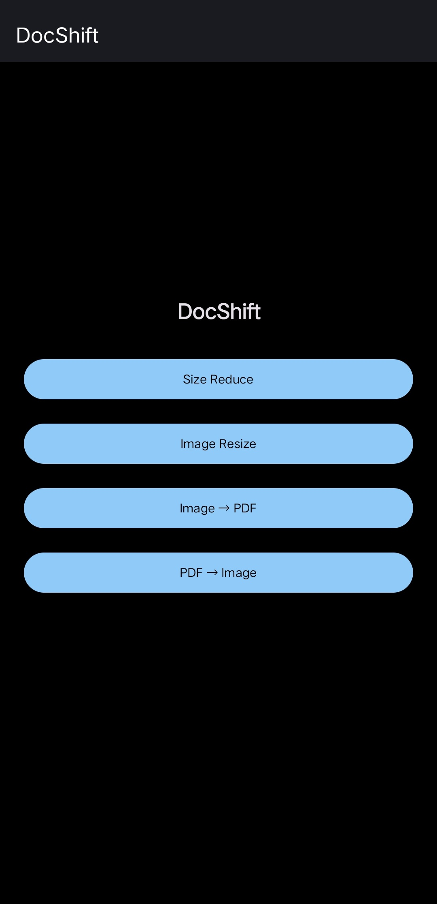
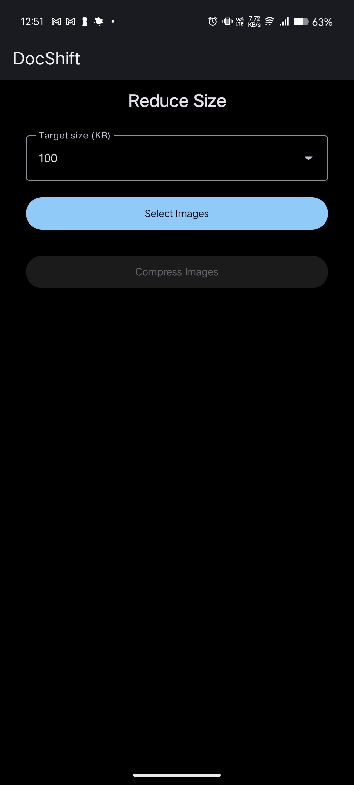
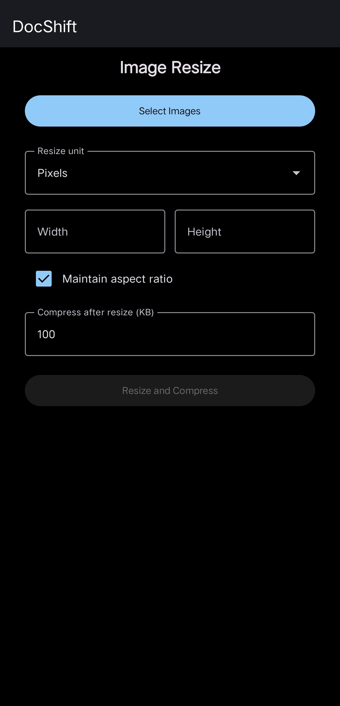
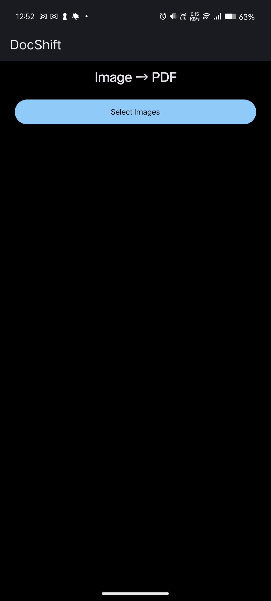
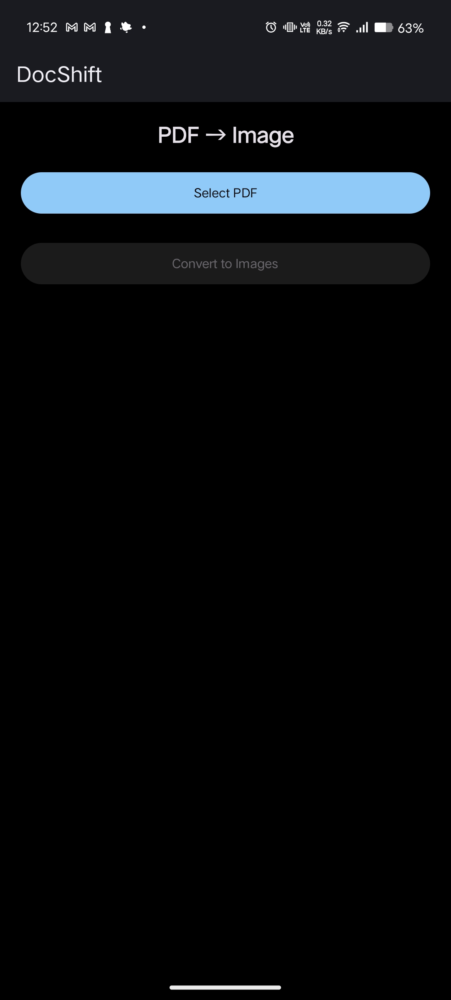

# DocShift

DocShift is a lightweight yet powerful Android utility app for working with images and PDFs completely offline.

It provides advanced image compression, image resizing, batch processing, PDF utilities, and smart file handling designed for students, professionals, creators, and everyday Android users.

---

## Features

### Image Compression
- Compress images to an exact target file size
- Supports presets like:
  - 20 KB
  - 50 KB
  - 100 KB
  - 200 KB
  - 500 KB
  - 1 MB
- Smart compression algorithm with minimal quality loss
- Batch image compression support
- Compression reports showing:
  - Original size
  - Final size
  - Saved space

---

### Advanced Image Resizing

Resize images using multiple measurement systems:

- Resize by Pixels
- Resize by Centimeters
- Resize by Inches

Additional controls:
- Optional Maintain Aspect Ratio
- Manual width and height adjustment
- Resize first, then compress to exact KB automatically

Useful for:
- Passport photos
- Government forms
- Exam applications
- Online uploads with strict dimension requirements
- Print-ready images

Because apparently every website on Earth invented its own image requirements just to test human patience.

---

### Camera Capture with Target Sizes

DocShift includes a smart camera workflow:

- Capture photos directly from camera
- Choose target size before capture
- Optimized output for:
  - 20 KB photos
  - 50 KB photos
  - 100 KB photos
  - Custom sizes
- Instant compression after capture

Designed for:
- Exam forms
- ID uploads
- Job portals
- Government applications

No more taking a 12 MB image just to brutally compress it afterward like medieval file torture.

---

### PDF Tools
- Convert one or multiple images into a single PDF
- Extract PDF pages as high-quality images
- High-quality rendering for text clarity
- Batch PDF processing support

---

### Batch Processing
- Compress multiple images at once
- Save time during bulk workflows
- Real-time progress tracking
- Per-image compression reports

---

### Android Share Integration
DocShift works directly from Android’s Share menu.

You can:
- Share images from Gallery or Files
- Compress instantly
- Convert images to PDF
- Process shared files without opening the app manually

Fast workflows. Fewer taps. Slightly less suffering.

---

## Screenshots

| Home | Compression | Resize |
|------|-------------|---------|
|  |  |  |

| Image to PDF || PDF to Image |
|---------------|---------------|
|  |  |

---

## Quality Notes

- Exact KB targeting using smart binary-search compression
- High-quality JPEG optimization
- Minimal visible quality degradation
- Aspect ratio preservation support
- High-DPI PDF rendering
- Local offline processing only
- No forced downscaling unless requested

---

## Privacy

All processing happens entirely on your device.

- No internet required
- No accounts
- No analytics
- No tracking
- No cloud upload

Your files stay on your phone. A revolutionary concept in modern software.

---

## Tech Stack

- Kotlin
- Jetpack Compose
- Android Storage Access Framework
- MediaStore API
- FileProvider
- Coroutines

---

## Project Status

DocShift is actively maintained and under continuous development.

### Planned Features
- AI image enhancement
- HEIC/WebP support
- Custom file rename
- Background processing
- Better PDF optimization
- Dark mode customization
- Metadata cleaner
- Document scanner

---

## Getting Started (Developers)

1. Clone the repository
2. Open in Android Studio
3. Let Gradle sync finish
4. Run on a real device or emulator

---

## License

This project is licensed under the MIT License.

---

## Author

Developed by **Ayush Kumar**.
